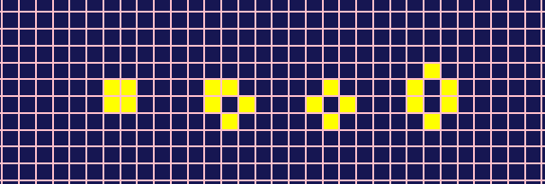
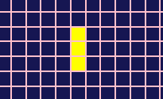
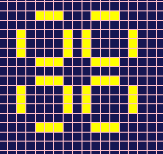
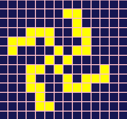
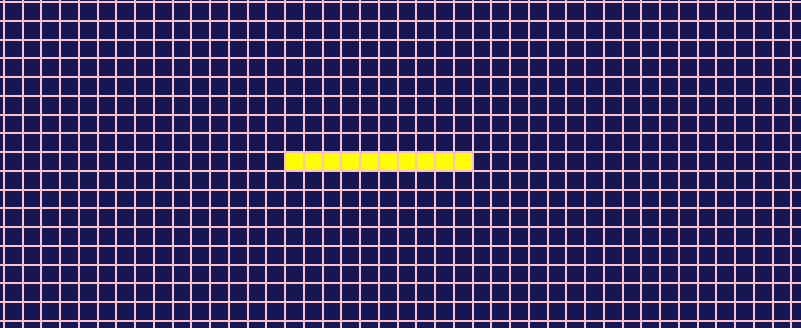
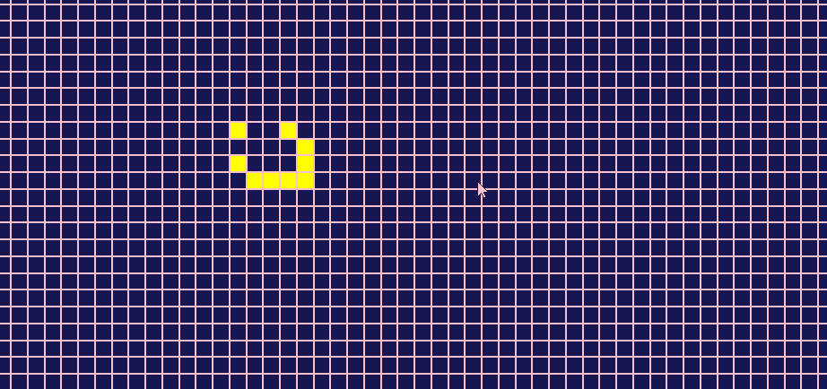

Tu te demandes sûrement ce qu'est le Jeu de la vie. Malgré son nom, ce n'est pas un jeu à proprement parler. On n'y joue pas vraiment et il n'y a pas de notion de victoire. C'est plus un genre de simulation.

Plus exactement, le jeu de la vie est un automate cellulaire inventé par un mathématicien britanique du nom de John Conway dans les années 70. L'automate va évoluer selon l'état de départ que l'on va lui donner. C'est la seule interaction que l'on aura avec lui, ensuite il évoluera tout seul selon un ensemble de règles très simple.

## Le Jeu de la vie

### Le cadre

Le Jeu de la vie se déroule sur un espace à 2 dimensions composé de cases à l'infini. Une cellule va occupé chaque case. Si la cellule est en vie, la case est colorée. Si elle est morte, la case reste inchangée.

### Les règles

Le Jeu de la vie se compose de 3 règles très simples:

- toute cellule vivante, entourée de 2 ou 3 autres cellules vivantes, reste en vie, sinon elle meurt
- toute cellule morte, entourée de 3 cellules vivantes exactement, renaît
- et toute cellule morte ne remplissant pas la condition précédente reste morte

Tu vas voir qu'avec ces 3 règles, des choses étonnantes vont se produire.

### Les patterns

Plusieurs structures ou patterns sont connus dans le jeu de la vie. Je vais t'en présenter ici quelques uns des plus célèbres.

#### Les structures stables

Comme son nom l'indique, une structures stable est une structure qui ne change jamais au fil des générations. Il reste stable. C'est le cas notamment du Bloc, du Bateau, du Tube et de la Ruche.

#### Les oscillateurs

Ce sont des structures qui changent et reprennent leur forme de départ au bout de N générations. On dit que ce sont des structures périodiques. Par exemple cette structure appelée Clignotant, reprend sa forme toutes les 2 générations.

##### Le pulsar (période 3)

##### La galaxie de kok (période 8)

##### Le pentadécathlon (période 15)

#### Les vaisseaux

Ce sont des structures qui se déplacent d'une génération à l'autre. Les vaisseaux sont des structures relativement bien connus depuis l'invention du jeu de la vie car elles apparaissent plus ou moins spontanément dans beaucoup de configurations de départ.

##### Le planneur

##### Le LWSS

Beaucoup d'autres structures existent dans le jeu de la vie. Je t'ai montré uniquement les quelques structures typiques. Si tu veux en savoir plus, je te conseille l'excellente vidéo youtube de la chaîne [Science étonnante](https://www.youtube.com/watch?v=S-W0NX97DB0) sur le sujet.

## Implémentation du Jeu de la vie avec React

Site : https://game-of-life-bay.vercel.app/
