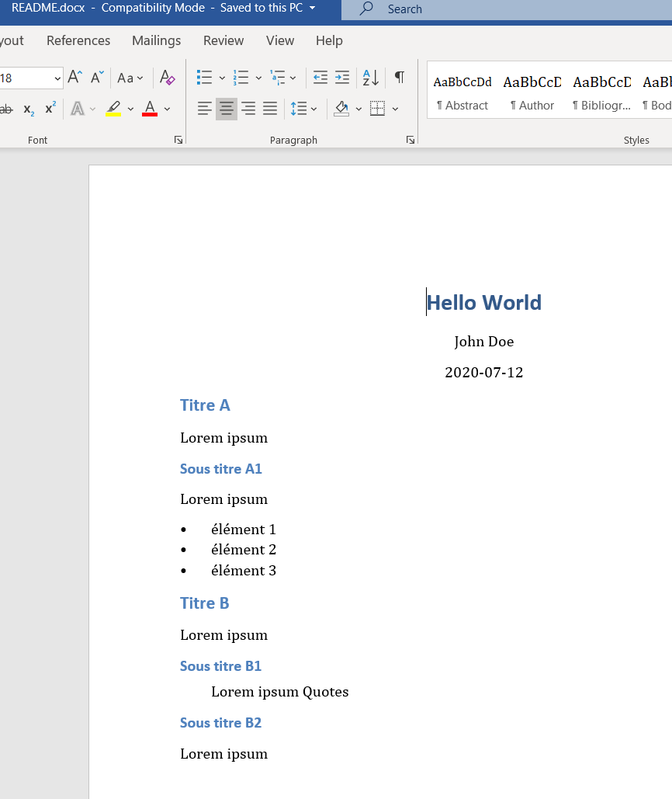
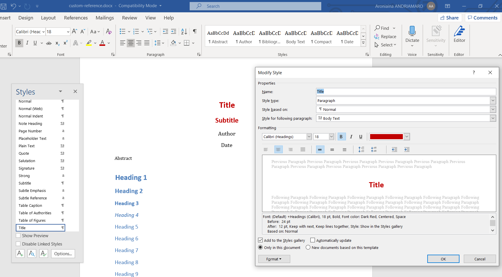
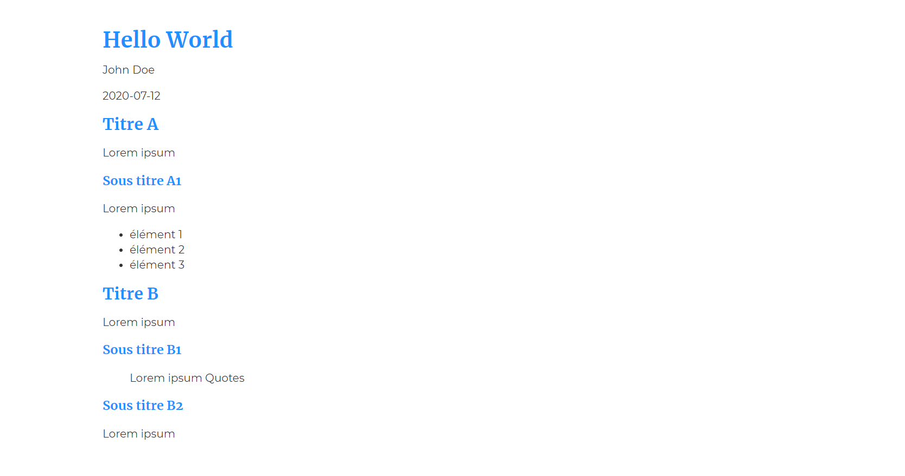
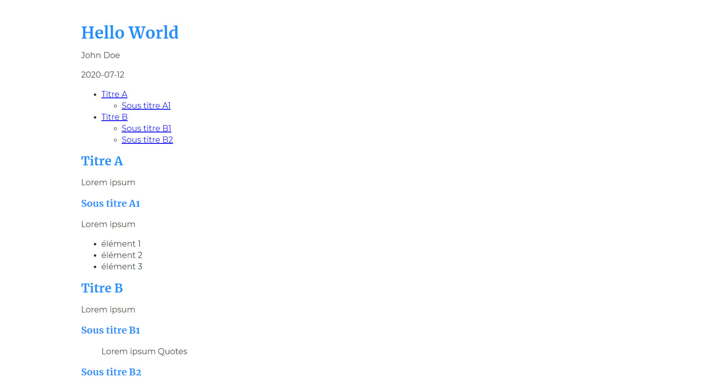
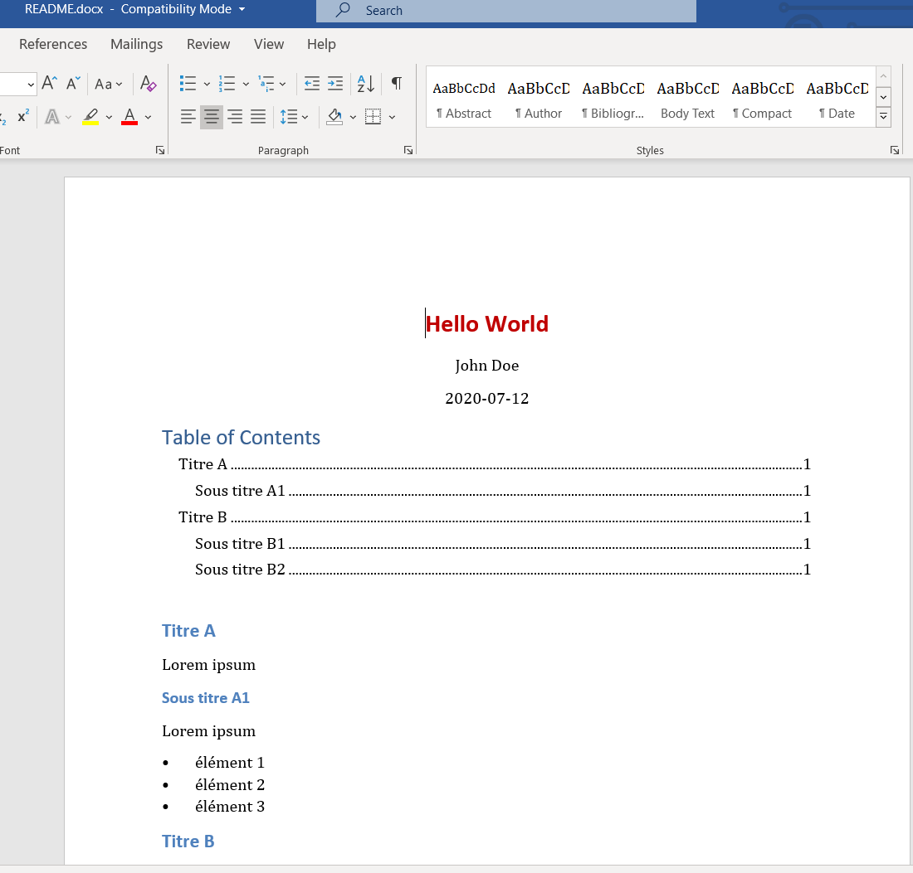
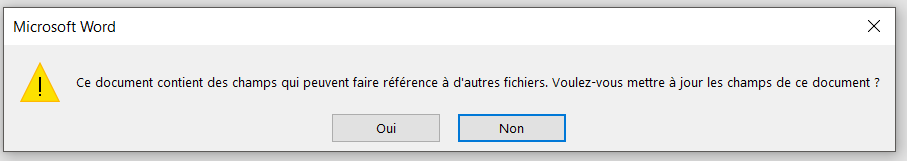

Salut à toi, jeune développeur !


Je déteste Microsoft Word. Non vraiment, je hais Word. Peut-être que ça vient du fait que je n'ai jamais vraiment pris la peine de bien le maîtriser.

Ou aussi peut-être qu'il m'est lié émotionnellement depuis la fac à des mauvais souvenirs de compte rendu de TP ou d'exposé à rendre avant midi alors qu'il est 11H55 et qu'on est à peine à 4 pages sur les 5 demandées, page de garde non comprise, et que ce p\*tain de sommaire ne veut pas se mettre à jour.

Mais c'est fini tout ça. Récemment j'ai dû écrire une documentation développeur pour ma dernière mission. Le problème c'est que je l'ai écrite en Markdown, et je comptais le convertir en PDF. Sauf que le client voulait avoir accès à la doc, pour la modifier dans le futur.

Donc j'ai cherché un moyen de convertir facilement du markdown en Word, et je suis tombé sur Pandoc.

## Introduction

[Pandoc](https://pandoc.org/index.html) est un outil en ligne de commande permettant de convertir des fichiers de type [markup](https://en.wikipedia.org/wiki/Markup_language) en divers formats. Il peut notamment convertir dans les 2 sens :

- markdown (.md) <-> word (.docx)
- markdown <-> html
- markdown <-> lateX
- etc...

Il est utilisé habituellement pour écrire de la documentation technique, des papiers scientifiques et des livres. En savoir plus [ici](https://en.wikipedia.org/wiki/Pandoc).

## Installation

Je ne vais pas m'étaler longuement dessus, tu as juste à télécharger l'[installeur](https://pandoc.org/installing.html) sur le site officiel. Rien de spécial à ajouter.

Cependant pour la conversion en PDF, Pandoc utilise [LateX](https://fr.wikipedia.org/wiki/LaTeX) par défaut. Tu devras donc installer une implémentation de LateX pour gérer les PDF, la doc officielle conseille [MiKTeX](https://miktex.org/download).

## Les bases

Pour utiliser Pandoc, tu as besoin d'un terminal. Sur windows, **cmd** ou **powershell** feront très bien l'affaire. Mais je te conseille quand même d'utiliser l'une de ces options:

- [Git bash](https://gitforwindows.org/)
- [Le terminal intégré de VS Code](https://code.visualstudio.com/)
- [cmder](https://cmder.net/) ou [hyper](https://hyper.is/)

Dans les exemples qui suivent on va partir du fichier Markdown ci-dessous, que j'ai appelé _README.md_:

```markdown
---
title: "Hello World"
author: "John Doe"
date: "2020-07-12"
---

## Titre A

Lorem ipsum

### Sous titre A1

Lorem ipsum

- élément 1
- élément 2
- élément 3

## Titre B

Lorem ipsum

### Sous titre B1

> Lorem ipsum Quotes

### Sous titre B2

Lorem ipsum
```

Si tu ne connais pas le markdown, c'est un langage de markup. Il permet de formater du texte assez facilement. Tu peux l'apprendre très rapidement avec ce [cheatsheet](https://www.markdownguide.org/cheat-sheet).

Un fichier markdown a l'extension _.md_. Et tu peux l'ouvrir avec n'importe quel éditeur de texte.

### Convertir des fichiers

Pour convertir un fichier, il te suffit d'ouvrir un terminal dans le dossier où tu souhaites travailler tes fichiers et de taper la commande:

```bash
pandoc fichier_a_convertir -o fichier_cible
```

L'argument _-o_ ici signifie _output_. Cet argument doit être suivi directement du nom de ton fichier cible.

Exemple: pour convertir notre fichier markdown _README.md_ en fichier word _README.docx_, ça donne :

```bash
pandoc README.md -o README.docx
```



Un fichier _README.docx_ se créera alors dans le même répertoire. Comme tu peux le constater, tous les éléments qu'on a renseigné dans le markdown se retrouvent joliment formaté dans word sans avoir eu besoin de toucher à l'interface de microsoft.

Les formats des fichiers sont implicitement renseignés par les extensions renseignés dans le nom, mais de manière alternative tu peux renseigner le format de chaque fichier avec les arguments suivants :

- _-f_ (from) : format du fichier à convertir
- _-t_ (to) : format du fichier cible

Exemple: la commande ci-dessous aboutit au même résultat que celle de l'exemple précédent:

```bash
pandoc README.md -f markdown -t docx -o README.docx
```

### Convertir des fichiers avec un visuel personnalisé

Jusqu'à maintenant, les fichiers cibles sont produits avec un visuel par défaut. Mais tu peux personnaliser ce visuel (police, couleur, etc...).

#### Personnaliser un fichier word

Pandoc se sert d'un style par défaut contenu dans un fichier appelé _reference.docx_, pour convertir vers des fichiers word _.docx_.

Pour le personnaliser, tu dois d'abord faire une copie de _reference.docx_ dans ton dossier de travail.

Pour cela, execute la commande suivante :

```bash
pandoc -o custom-reference.docx --print-default-data-file reference.docx
```

Après exécution, un fichier _custom-reference.docx_ apparaît dans ton dossier. C'est ce fichier qui servira désormais de base pour la conversion vers un _.docx_. C'est un fichier word classique dans lequel tu peux modifier à ta guise les styles visuels.


Pour que Pandoc utilise _custom-reference.docx_ comme base de style, tu dois le renseigner avec l'argument _--reference-doc=_ suivi du chemin relatif vers _custom-reference.docx_

Exemple: on va produire un README.docx à partir de README.md mais avec un titre principal en rouge. Avant tout, tu dois modifier le style de _title_ dans custom-reference.docx comme ceci.



Ensuite, tu exécutes la commande:

```bash
pandoc README.md --reference-doc=custom-reference.docx -o README.docx
```


#### Personnaliser un fichier html

La conversion en html marche aussi très bien, mais à l'inverse de la conversion en word, aucun style par défaut n'est appliqué par Pandoc.

```bash
pandoc README.md -s -o README.html
```

> L'argument _-s_ signifie _standalone_. Il permet de créer un fichier html complet dans le sens où le head avec les métadonnées seront aussi générés. Sans cet argument, tu auras juste un fragment du html.

Tu te retrouves alors avec un README.html comme ceci:


Pour cibler un fichier html personnalisé, tu peux le faire avec l'argument _-c_ ou _--css=_. La valeur de l'argument étant un fichier _.css_.

Tu peux créer ton propre fichier css ou copier-coller l'exemple ci-dessous que j'ai nommé _style.css_:

```css
@import url("https://fonts.googleapis.com/css2?family=Merriweather:wght@400;700&family=Montserrat:wght@400;700&display=swap");

* {
  box-sizing: border-box;
}
body {
  margin: auto;
  max-width: 80vw;
  padding: 2.5rem;
  color: black;
  font-family: "Montserrat", sans-serif;
  line-height: 140%;
  color: #333;
}
img {
  display: block;
  margin: 0 auto;
  max-width: 60%;
}
figcaption {
  font-size: 1rem;
  color: #757575;
  text-align: center;
}
pre {
  border: none;
  border-radius: 5px;
  background-color: #333;
  color: #eee;
  padding: 1rem;
}
code {
  font-family: monospace;
  font-size: 0.75rem;
}
h1,
h2,
h3,
h4,
h5,
h6 {
  font-family: "Merriweather", serif;
  color: dodgerblue;
}
th,
td {
  text-align: left;
  padding-right: 1rem;
}
```

Ensuite, pour générer le fichier _README.html_ stylisé:

```bash
pandoc README.md -s -c style.css -o README.html
```



#### Générer automatiquement le sommaire

Tu peux générer automatiquement un sommaire pour n'importe quel format de fichier qui s'y prête (docx, html, pdf, etc...). Pour cela, tu dois renseigner l'argument _--toc_ (pour _table of contents_). Cet argument doit toujours être utilisé conjointement avec l'argument -s (pour _standalone_).

Exemple: re générons le fichier README.html à partir de README.md mais avec un sommaire cette fois-ci.

```bash
pandoc README.md -s -c style.css --toc -o README.html
```



Similairement, pour générer un fichier word README.docx avec le sommaire:

```bash
pandoc README.md -s --toc --reference-doc=custom-reference.docx -o README.docx
```



**Remarque**: à la première ouverture du fichier word généré avec sommaire, une boîte de dialoge apparaît, tu dois appuyer sur _Oui_ pour que le sommaire soit produit.



## Conclusion

Voilà, maintenant tu sais comment convertir n'importe quel fichier en d'autres formats. Si toi aussi tu n'aimes pas Word, tu peux maintenant te servir de ton nouveau super pouvoir pour faire de la doc.

Ce n'était qu'une petite introduction à Pandoc, je te conseille vivement de lire la [documentation officielle](https://pandoc.org/MANUAL.html) pour en savoir plus. Notamment sur comment convertir en PDF (ça nécessite quelques étapes en plus).

En attendant, je te dis à la prochaine. Bisous!
