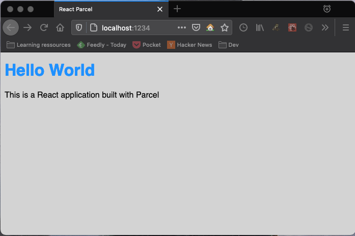

## Pré-requis

- Node installé
- Npm ou Yarn installé
- notions en React

## Introduction

Commencer un projet React est très facile grâce à des outils comme `create-react-app` . Mais si nous voulons aller plus loin et personnaliser le projet selon notre besoin, il est impératif d'utiliser un bundler.

## Module bundler

Un module bundler est un outil utilisé en frontend pour assembler les différents fichiers de notre projet. Typiquement si notre code source ressemble à cela

```text
package.json
src
|-- index.js
|-- components
    |-- App.js
    |-- App.css
```

Un bundler nous permet d'assembler ces fichiers en un seul fichier _javascript_ et _css_ qui seront envoyés au navigateur

```text
dist
|-- script.js
|-- style.css
|-- index.html
```

Mais il ne fait pas que cela, le bundler nous permet d'effectuer différentes opérations sur les fichiers de notre code source.

> Le bundler nous permet notamment de faire du [code-splitting](https://reactjs.org/docs/code-splitting.html), de la [minification](<https://en.wikipedia.org/wiki/Minification_(programming)>), ou encore d'appliquer des transformations grâce à un compilateur comme [Babel](https://babeljs.io/)

## Parcel ou le bundler à zéro configuration

Il existe plusieurs bundlers plus ou moins faciles à utiliser. Parmi les plus faciles nous avons [Parcel](https://parceljs.org/) qui se veut "zéro configuration". C'est-à-dire qu'on peut le mettre en place très rapidement.

> Je pense que Parcel est l'outil parfait pour un développeur débutant avec React habitué à `create-react-app` pour s'essayer aux bundlers.

### Installation

Pour installer Parcel sur un projet il suffit d'exécuter

```bash
yarn add -D parcel@next

# ou
npm install -D parcel@next
```

> Parcel est un outil de développement, donc il fait partie des dépendances de dev d'où l'argument `-D`

> Nous allons utiliser [Parcel 2](https://v2.parceljs.org/) qui est encore en version [beta](https://v2.parceljs.org/blog/beta1/). Par rapport à la version 1, je trouve que l'API est plus simplifiée. Mais ne t'en fais pas, si tu veux utiliser [Parcel 1](https://parceljs.org/getting_started.html) ce n'est qu'une question d'adaptation.

## Création d'un projet React

### Initialisation du package.json

Pour créer notre projet React, il faut d'abord créer le fichier `package.json`. Pour cela, nous allons nous mettre dans un dossier `react-parcel` puis exécuter `npm init -y`

```bash
mkdir react-parcel
cd react-parcel
npm init -y
```

> `-y` permet d'initialiser notre projet avec toutes les informations par défaut dans le `package.json`

### Installation des dépendances

En dehors de Parcel, le minimum nécessaire à installer pour créer notre projet sont `react` et `react-dom`

```bash
yarn add react react-dom
yarn add -D parcel

# ou
npm install react react-dom
npm install -D parcel
```

### Hello World React

Nous allons mettre en place un projet Hello World très simple. Dans `react-parcel`, nous allons créer un dossier `src` et dedans on y mettra les fichiers `index.js` et `index.html`

```bash
# dans react-parcel
mkdir src
cd src
touch index.js
touch index.html
```

`index.html` est le point d'entrée de notre projet React (ce qui rend Parcel différent des autres bundlers qui spécifient un fichier Javascript en point d'entrée). Dedans nous allons écrire

```html
<!DOCTYPE html>
<html>
  <head>
    <title>React Parcel</title>
  </head>
  <body>
    <div id="root"></div>
    <script type="module" src="index.js"></script>
  </body>
</html>
```

> Comme tu peux le constater, nous référençons notre fichier `index.js`dans le fichier `index.html` en spécifiant le `type="module"`

> L'élément `div` avec l'identifiant `root` nous permettra d'encrer notre application React à cet endroit

Dans `index.js`, nous allons écrire

```jsx
import React from 'react'
import { render } from 'react-dom'
import App from './components/App'

render(<App />, document.getElementById('root'))
```

Et enfin, nous allons créer un dossier `components`dans le dossier `src` où on y mettra les fichiers `App.js` et `App.css`

```bash
# dans src
mkdir components
cd components
touch App.js
touch App.css
```

```jsx
// App.js
import React from 'react'
import './App.css'

const App = () => (
  <main>
    <h1>Hello World</h1>
    <p>This is a React application built with Parcel</p>
  </main>
)

export default App
```

```css
/* App.css */
body {
  background-color: lightgray;
  font-family: sans-serif;
}

h1 {
  color: dodgerblue;
}
```

### Scripts Parcel

Pour lancer Parcel et construire notre projet, nous allons modifier le fichier `package.json` pour ajouter les scripts de commande suivants

```json
{
  // ...
  "scripts": {
    "start": "parcel serve src/index.html",
    "build": "parcel build src/index.html"
  }
  // ...
}
```

> `parcel serve` permet de lancer le projet en mode développement. Parcel est configuré par défaut avec le `Hot Reload` qui permet d'effectuer des modifications dans le code et d'appliquer ces changements dans l'application sans rafraîchir la page du navigateur

> `parcel build` permet de construire et de bundler le projet dans un dossier appelé `dist` (pour distribution). Ce dossier peut ensuite être déployé sur un serveur (`Netlify` ou `Github pages` par exemple)

### Exécution

Lançons maintenant notre projet en exécutant la commande

```bash
yarn start

# ou
npm run start
```

Par défaut le serveur de Parcel se lance sur [http://localhost:1234](http://localhost:1234/)



Et voilà ✨ Nous venons de configurer simplement une application React avec Parcel 😁

## Pour aller plus loin

Parcel est très facile à mettre en place. Cependant, ce que nous avons vu ne nous permet pas de traiter tous les cas d'utilisation.

Je te conseille vivement de lire la documentation ([v1](https://parceljs.org/getting_started.html) ou [v2](https://v2.parceljs.org/)) pour connaître tout ce que tu peux réaliser avec cet outil.

> Parcel est très puissant mais personnellement je préfère utiliser [Webpack](https://webpack.js.org/) pour avoir plus de flexibilité et de contrôle. Mais ce sera pour un autre article.

Voici quelques trucs en plus que tu peux essayer de mettre en place pour t'entraîner

- utiliser un préprocesseur CSS (sass)
- configurer le code-splitting
- configurer un proxy vers un serveur d'API
