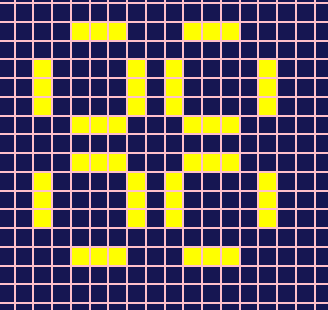
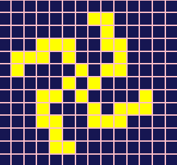
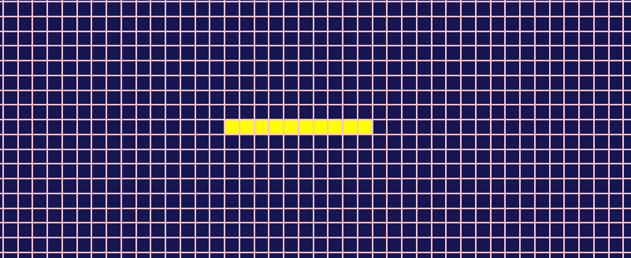
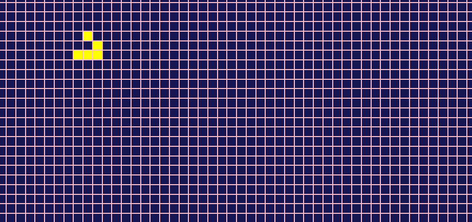
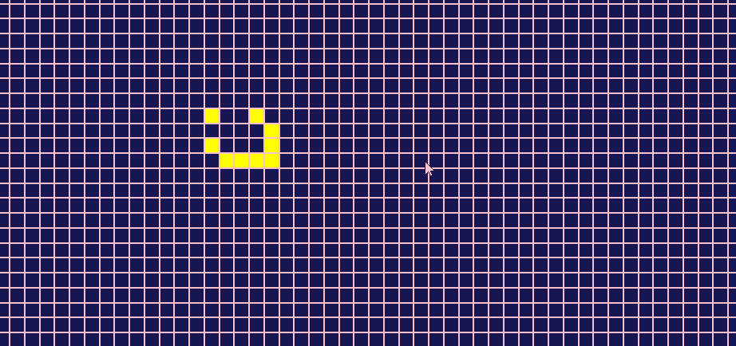

Tu te demandes sûrement ce qu'est le Jeu de la vie. Malgré son nom, ce n'est pas un jeu à proprement parler. On n'y joue pas vraiment et il n'y a pas de notion de victoire. C'est plus un genre de simulation.

Plus exactement, le jeu de la vie est un automate cellulaire inventé par un mathématicien britanique du nom de John Conway dans les années 70. L'automate va évoluer selon l'état de départ que l'on va lui donner. C'est la seule interaction que l'on aura avec lui, ensuite il évoluera tout seul selon un ensemble de règles très simple.

> &#128204; Tu peux tester le jeu de la vie sur ce [site](https://game-of-life-bay.vercel.app/) (pour les plus curieux, je l'ai développé en React en utilisant les hooks).

## I. Le Jeu de la vie

### Le cadre

Le Jeu de la vie se déroule sur un espace à 2 dimensions composé de cases à l'infini. Une cellule va occuper chaque case. Si la cellule est en vie, la case est colorée. Si elle est morte, la case reste inchangée.

### Les règles

Le Jeu de la vie se compose de 3 règles très simples:

- toute cellule vivante, entourée de 2 ou 3 autres cellules vivantes, reste en vie, sinon elle meurt
- toute cellule morte, entourée de 3 cellules vivantes exactement, renaît
- et toute cellule morte ne remplissant pas la condition précédente reste morte

Tu vas voir qu'avec ces 3 règles, des choses étonnantes vont se produire.

### Les patterns

Plusieurs structures ou patterns sont connus dans le jeu de la vie. Je vais t'en présenter ici quelques uns des plus célèbres.

> &#128204; Pour découvrir de nouvelles structures, le plus simple est de remplir les cases aléatoirement et de voir où est-ce que ça va mener.

#### Les structures stables

Comme son nom l'indique, une structure stable est une structure qui ne change jamais au fil des générations. Il reste stable. C'est le cas notamment du Bloc, du Bateau, du Tube et de la Ruche.


#### Les oscillateurs

Ce sont des structures qui changent et reprennent leur forme de départ au bout de N générations. On dit que ce sont des structures périodiques. Par exemple cette structure appelée Clignotant, reprend sa forme toutes les 2 générations.

<div style="text-align:center;">

</div>

##### Le pulsar (période 3)

<div style="text-align:center;">

</div>

##### La galaxie de kok (période 8)

<div style="text-align:center;">

</div>

##### Le pentadécathlon (période 15)

<div style="text-align:center;">

</div>

#### Les vaisseaux

Ce sont des structures qui se déplacent d'une génération à l'autre. Les vaisseaux sont des structures relativement bien connus depuis l'invention du jeu de la vie car elles apparaissent plus ou moins spontanément dans beaucoup de configurations de départ.

##### Le planneur

<div style="text-align:center;">

</div>

##### Le LWSS

<div style="text-align:center;">

</div>

Beaucoup d'autres structures existent dans le jeu de la vie. Je t'ai montré uniquement les quelques structures typiques. Si tu veux en savoir plus, je te conseille l'excellente vidéo de la chaîne [Science étonnante](https://www.youtube.com/watch?v=S-W0NX97DB0) sur Youtube.

## II. Implémentation du Jeu de la vie

Comme les règles du jeu de la vie sont très simples, on peut facilement écrire un alogrithme pour créer le jeu. C'est ce que je vais te montrer dans cette partie.

Je vais donner des exemples en Javascript, mais ne t'en fais pas j'essaierai de ne pas utiliser des fonctions spécifiques au Javascript pour que tu puisses facilement écrire l'algorithme dans d'autres langages.

### La structure de données

Vu que le jeu consiste en un ensemble de cases en deux dimensions, le choix le plus évident est de partir sur un tableau 2D pour stocker l'état des cellules d'une génération à l'autre. On va remplir le tableau de 0 ou de 1 selon que la cellule est morte ou vivante.

### Déroulement du jeu

Considérons un tableau 3 par 3 comme ci-dessous avec 5 cellules vivantes au départ. On va appeler cet état de départ la génération 0. Et à chaque fois qu'on applique les règles du jeu de la vie, on passe à la prochaine génération et ainsi de suite.

```text
Génération 0   Génération 1   Génération 2
0|1|0          1|1|0          1|1|0
1|1|0       -> 1|0|0       -> 0|0|1
0|1|1          1|1|1          1|1|0
```

### L'algorithme

Pour appliquer les règles du jeu de la vie, il faudra parcourir le tableau de gauche à droite et de haut en bas, cellule par cellule.

Pour chaque cellule, on va compter le nombre de cellules voisines pour décider si elle vit ou non à la prochaine génération.

Il est important d'appliquer la décision de vie ou de mort d'une cellule qu'à la génération suivante. Il faudra donc copier le tableau 2D, faire l'analyse sur l'originale et appliquer les décisions sur la copie.

A la fin de l'analyse, la copie deviendra la prochaine génération, et on recommence. Cela donne alors cet algorithme:

> &#128204; La phase de copie du tableau d'origine n'est pas illustrée dans l'algorithme pour faciliter la lisibilité

```text
tab = [[0,1,0],[1,1,0],[0,1,1]]

Pour chaque sous-tableau row de tab
  Pour chaque élément cell de row
    Si cell vaut 1 // c'est-à-dire cell est vivante
      Si cell a 2 voisines OU 3 voisines
        On assigne cell = 1
      Sinon
        On assigne cell = 0
    Sinon // c'est-à-dire cell est morte
      Si cell a exactement 3 voisines
        On assigne cell = 1
      Sinon
        On assigne cell = 0
```

Comme je l'ai dit plus haut, l'algorithme en soit est vraiment simple à écrire, mais son implémentation dans la pratique est un peu plus compliquée. Mais rien de très complexe hein, il faut juste y réfléchir un peu plus.

Notamment, le comptage des cellules voisines pour une cellule donnée n'est pas si évident que ça. De plus il faudra prendre en compte les cellules en bord de tableau.

Pour compter les cellules voisines, il suffira d'effectuer un petit calcul sur l'index de la cellule en cours pour accéder aux index de ses voisines dans le tableau. Une cellule donnée qui n'est pas située au bord du tableau a 8 voisines. Donc, il y a 8 opérations à effectuer pour obtenir les coordonnées de chaque cellule voisine.

Et pour gérer les bords, il faudra à chaque instant vérifier si le résultat du calcul d'index des voisines dépasse la taille du tableau ou est négatif.

En pratique, en Javascript, cela donnerait le code suivant:

```javascript
const operations = [
  [-1, -1], // en haut à gauche
  [-1, 0], // en haut au milieu
  [-1, 1], // en haut à droite
  [0, -1], // à sa gauche
  [0, 1], // à sa droite
  [1, -1], // en bas à gauche
  [1, 0], //  en bas au milieu
  [1, 1], //   en bas à droite
]

const tab = [
  [0, 1, 0],
  [1, 1, 0],
  [0, 1, 1],
]
const copie = [
  [0, 1, 0],
  [1, 1, 0],
  [0, 1, 1],
]

const lignes = tab.length
const colonnes = tab[0].length

// On parcourt le tableau 2D
for (let i = 0; i < lignes; i++) {
  for (let j = 0; j < colonnes; j++) {
    // Initialisation du nombre de voisines à 0 pour chaque cellule parcourue
    let voisines = 0

    for (let k = 0; k < operations.length; k++) {
      const indexVoisineLigne = i + operations[k][0]
      const indexVoisineColonne = j + operations[k][1]
      // on compte le nombre de voisines
      if (
        indexVoisineLigne >= 0 &&
        indexVoisineLigne < lignes &&
        indexVoisineColonne >= 0 &&
        indexVoisineColonne < colonnes
      ) {
        voisines += tab[indexVoisineLigne][indexVoisineColonne]
      }
    }
    // Application de l'algorithme
    // Selon le nombre de voisines et selon son état actuel,
    // On décide si la cellule vit ou meurt
    // IMPORTANT: il faut bien assigner le nouvel état de la cellule à la copie du tableau
    if (tab[indexVoisineLigne][indexVoisineColonne] === 1) {
      copie[i][j] = voisines === 2 || voisines === 3 ? 1 : 0
    } else {
      copie[i][j] = voisines === 3 ? 1 : 0
    }
  }
}
```

Comme tu peux le voir, le coeur de l'algrithme ne constitue finalement qu'une petite partie du code. Ce qui montre bien qu'un algorithme peut être simple à écrire mais plus difficile à implémenter (selon le langage).

Il faudra appliquer cette série d'étapes entre chaque génération. Une dernière difficulté dans l'implémentation c'est la copie du tableau d'origine. Ci-dessus j'ai juste assigné la même valeur que l'original à la copie.

Mais en pratique, il faut créer une copie à partir du tableau d'origine. Tu peux essayer d'implémenter toi-même un algorithme de copie en profondeur d'un tableau, mais je te conseille de voir du côté des librairies telles que [immer](https://immerjs.github.io/immer/docs/introduction) si tu utilises Javascript.

Sinon pour les autres langages, regarde les librairies qui te permettent de travailler avec des structures de données immutables.

## III. Pour finir

Coder le Jeu de la vie est un très bon exercice pour un débutant avancé. Si tu viens de commencer la programmation, je te conseille d'essayer de l'implémenter dans le langage que tu es entrain d'apprendre (quoi que si tu es arrivé jusqu'ici, c'est que tu es décidé à le faire &#128523;).

En tout cas, c'était tout pour moi. Je te dis à la prochaine. Bisous &#128535;
