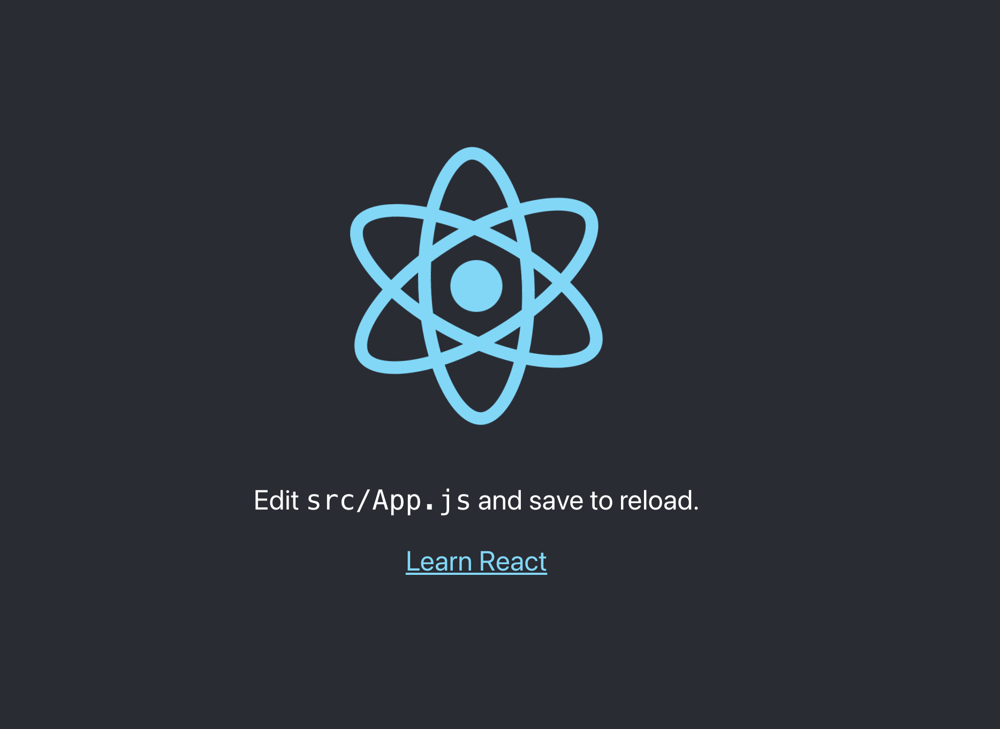
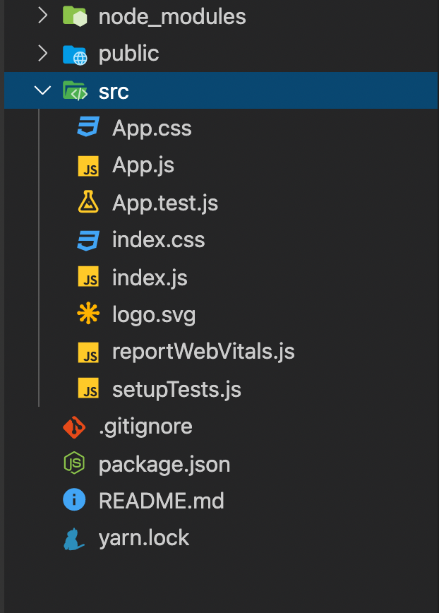

Si tu t'intéresses au développement web côté frontend tu t'apercevras vite que l'écosystème est dominé par 3 frameworks/librairies:

* [React](https://reactjs.org/) : développé par Facebook
* [Vue](https://vuejs.org/) : développé par un dev indé du nom de [Evan You](https://github.com/yyx990803), d'ailleurs je te conseille ce formidable [documentaire](https://www.youtube.com/watch?v=OrxmtDw4pVI) par la chaîne Honeypot sur la création de Vue
* [Angular](https://angular.io/) : développé par Google

React et Vue sont aujourd'hui les plus populaires sur le marché, mais Angular reste un choix tout à fait pertinent pour faire du frontend. Dans mon job et mes projets perso, je suis particulièrement à fond sur React. 

Alors oui, cela fait plusieurs mois que je n'ai pas écrit ici, mais je me suis dit pourquoi pas reprendre doucement avec un article présentant brièvement React et comment débuter avec. D'autant plus que je compte écrire une longue série d'articles en long en large et en travers sur ce framework et tout son écosystème. Mais avant tout, pour bien profiter de cet article, je te conseille d'avoir ces quelques pré-requis:

* connaître les bases de **HTML/CSS**
* connaître les bases de **Javascript** (spécialement la version **ES2015** ou **ES6**)
* savoir utiliser un outil de gestion de paquets ([npm](https://www.npmjs.com/) ou [yarn](https://yarnpkg.com/))

Allez c'est parti.

## Introduction

Commençons avec un petit peu d'histoire. React a été développé et utilisé en interne chez Facebook et la première version publique est sortie en 2013. Aujourd'hui tout un écosystème s'est développé autour de la librairie.

Pour React on parle bien de librairie et non vraiment de Framework car beaucoup de choix techniques sont laissés à test petits soins lors du développement. Mais dans la pratique, la dénomination n'est pas très importante, ce qui compte c'est de se faire comprendre.

## Tester React

Tu peux configurer très rapidement et très simplement un projet React sans avoir à installer quoi que ce soit. Dans un simple fichier HTML, il faut ajouter les scripts suivants:

```html
<script src="https://unpkg.com/react@17/umd/react.development.js" crossorigin></script>
<script src="https://unpkg.com/react-dom@17/umd/react-dom.development.js" crossorigin></script>
```

> On importe deux scripts (un pour **React** et un autre pour **ReactDOM**) car React peut aussi être utilisé pour le développement mobile avec [React Native](https://reactnative.dev/). ReactDom étant pour le web.

Importons ces scripts dans un fichier appelé *index.html*

```html
<!-- index.html -->
<!DOCTYPE html>
<html lang="en">
  <head>
    <meta charset="UTF-8" />
    <meta name="viewport" content="width=device-width, initial-scale=1.0" />
    <title>Débuter avec React</title>
  </head>
  <body>
    <div id="root"></div>
    <script src="https://unpkg.com/react@17/umd/react.development.js" crossorigin></script>
    <script src="https://unpkg.com/react-dom@17/umd/react-dom.development.js" crossorigin></script>
    <script src="App.js"></script>
  </body>
</html>
```

### Créer un élément avec React.createElement

Comme tu l'as peut-être remarqué, j'ai ajouté un div avec un id *root* et un autre script *App.js*. Notre application sera mis dans le div qui nous sert de conteneur et *App.js* contiendra le code de notre application React.

On peut maintenant écrire dans *App.js* le script suivant

```javascript
// App.js
const root = document.getElementById('root')
const divElement = React.createElement('div', { children: 'Hello World' })
ReactDOM.render(divElement, root)
```

Les deux choses les plus importantes ici sont

* **React.createElement**: permet de créer un composant react. Dans l'exemple, on crée un div qui contient le texte *Hello World*
* **ReactDOM.render**: fait le rendu du composant react sur le DOM

Ce n'est pas la manière standard d'écrire du react. Aujourd'hui, on utilise plutôt du JSX pour créer les composants. C'est un langage similaire au XML mais pour le Javascript. En JSX, notre exemple ressemblerait à ceci

```jsx
// App.js
const root = document.getElementById('root')
const divElement = <div>Hello World</div>
ReactDOM.render(divElement, root)
```

### JSX

Le JSX nous permet de créer des composants react de manière déclarative. Par exemple, pour créer un Button personnalisé

```jsx
// App.js
const root = document.getElementById('root')
// on déclare notre composant Button
function Button(){
  return <button className='btn'>Appuyez ici</button>
}
// puis on l'appelle comme n'importe quel élément HTML
const buttonElement = <Button/> 
ReactDOM.render(buttonElement, root)
```

> Le nom des composants react (c'est-à-dire les composants personnalisés que l'on crée) doivent commencer par un majuscule pour que React puisse faire la différence entre notre composant et un composant natif HTML

Mais le navigateur ne comprend (malheureusement) pas le JSX. Notre script doit être transformé (ou compilé si tu veux) pour être compréhensible par le runtime du navigateur. Pour cela, on utilise un outil qui s'appelle Babel, il suffit aussi d'importer un autre script pour l'utiliser.

```html
<!-- index.html -->
<!DOCTYPE html>
<html lang="en">
  <head>
    <meta charset="UTF-8" />
    <meta name="viewport" content="width=device-width, initial-scale=1.0" />
    <title>Débuter avec React</title>
  </head>
  <body>
    <div id="root"></div>
    <script src="https://unpkg.com/react@17/umd/react.development.js" crossorigin></script>
    <script src="https://unpkg.com/react-dom@17/umd/react-dom.development.js" crossorigin></script>
    <!-- Script Babel -->
    <script src="https://unpkg.com/babel-standalone@6/babel.min.js"></script>
    <!-- Puis on indique à babel le fichier à transformer grâce à l'attribut type='text/babel' -->
    <script src='App.js' type='text/babel'></script>
  </body>
</html>
```

```jsx
// App.js
const root = document.getElementById('root')
function Title() {
  return <h1>React app</h1>
}
function Text() {
  return <p>Hello world</p>
}
function App() {
  return (
    <div>
      <Title />
      <Text />
    </div>
  )
}
ReactDOM.render(<App />, root)
```

Le JSX est transformé en React.createElement et d'ailleurs tu peux utiliser ce [site](https://babeljs.io/repl#?browsers=defaults%2C%20not%20ie%2011%2C%20not%20ie_mob%2011&build=&builtIns=false&spec=false&loose=false&code_lz=Q&debug=false&forceAllTransforms=false&shippedProposals=false&circleciRepo=&evaluate=false&fileSize=false&timeTravel=false&sourceType=module&lineWrap=true&presets=env%2Creact%2Cstage-2&prettier=false&targets=&version=7.12.9&externalPlugins=) si tu veux voir en quoi exactement ton code JSX ressemble après la transformation.

## Installation

Comme tu as vu, il suffit de 3 scripts (React, ReactDOM et Babel) à ajouter à ton HTML pour s'essayer à React. Mais cette méthode n'est pas faite pour la production. En pratique on va plutôt passer par une installation via npm de tous les paquets dont on aura besoin pour configurer notre projet React.

### Create-react-app (CRA)

Il existe plusieurs moyens de configurer un projet React mais le plus facile est d'utiliser un outil qui s'appelle [create-react-app](https://create-react-app.dev/) (CRA est aussi développé par Facebook). Pour utiliser *CRA*, il faut au préalable que node soit installé. Tu peux l'installer [ici](https://nodejs.org/en/download/) (assure-toi de prendre une version >=10). Il te faut aussi un gestionnaire de paquets: [npm](https://www.npmjs.com/)(installé avec node) ou [yarn](https://classic.yarnpkg.com/en/docs/install/#mac-stable).

Puis dans un terminal dans le dossier de ton choix:

```bash
npx create-react-app mon-application
```

Un dossier *mon-application* se crée alors, tu peux y naviguer dedans avec:

```bash
cd mon-application
```

Ensuite pour lancer l'application:

```bash
yarn start

# ou

npm start
```



Par défaut, *CRA* va utiliser *yarn* comme gestionnaire de paquets s'il est installé sur ta machine. Sinon tu peux explicitement indiqué *npm* à la création du projet:

```bash
npx create-react-app mon-application --use-npm
```

Le dossier créé par \*CRA\* se présente comme ci-dessous



Pour l'instant, tu peux effacer tout les fichiers dans le dossier *src* et créer un nouveau fichier *index.js* contenant le code suivant:

```jsx
import React from 'react'
import ReactDOM from 'react-dom'

function App() {
  return (
    <div>
      <h1>Hello World</h1>
    </div>
  )
}

const root = document.getElementById('root')
ReactDOM.render(<App />, root)
``