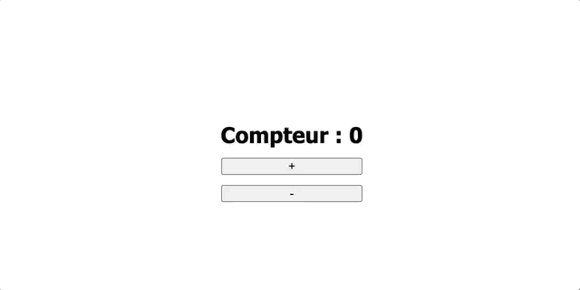

Si tu t'intéresses au développement web côté frontend, tu t'apercevras vite que l'écosystème est dominé par 3 frameworks/librairies:

- [React](https://reactjs.org/) : développé par Facebook
- [Vue](https://vuejs.org/) : développé par un dev indé du nom de [Evan You](https://github.com/yyx990803), d'ailleurs je te conseille ce formidable [documentaire](https://www.youtube.com/watch?v=OrxmtDw4pVI) de la chaîne YouTube Honeypot sur la création de Vue
- [Angular](https://angular.io/) : développé par Google

React et Vue sont aujourd'hui les plus populaires sur le marché, mais Angular reste un choix tout à fait pertinent pour faire du frontend. Dans mon job et mes projets perso, je suis particulièrement à fond sur React.

Alors oui, cela fait plusieurs mois que je n'ai pas écrit ici, mais je me suis dit pourquoi pas reprendre doucement avec un article présentant brièvement React et comment débuter avec. D'autant plus que je compte écrire une longue série d'articles sur ce framework et tout son écosystème. Mais avant tout, pour bien profiter de cet article, je te conseille d'avoir ces quelques pré-requis:

- connaître les bases de **HTML/CSS**
- connaître les bases de **Javascript** (spécialement la version **ES2015** ou **ES6**)
- savoir utiliser un outil de gestion de paquets ([npm](https://www.npmjs.com/) ou [yarn](https://yarnpkg.com/))

Allez c'est parti.

## Introduction

Commençons avec un petit peu d'histoire. React a été développé et utilisé en interne chez Facebook. La première version publique est sortie en 2013. Aujourd'hui tout un écosystème s'est développé autour de la librairie.

Pour React on parle bien de librairie et non vraiment de Framework car beaucoup de choix techniques sont laissés à tes petits soins lors du développement. Mais dans la pratique, la dénomination n'est pas très importante, ce qui compte c'est de se faire comprendre.

## Tester React

Tu peux configurer très rapidement et très simplement un projet React sans avoir à installer quoi que ce soit. Dans un simple fichier HTML, il faut ajouter les scripts suivants:

```html
<script
  src="https://unpkg.com/react@17/umd/react.development.js"
  crossorigin
></script>
<script
  src="https://unpkg.com/react-dom@17/umd/react-dom.development.js"
  crossorigin
></script>
```

> On importe deux scripts (un pour **React** et un autre pour **ReactDOM**) car React peut aussi être utilisé pour le développement mobile avec [React Native](https://reactnative.dev/). ReactDom étant pour le web.

Importons ces scripts dans un fichier appelé _index.html_

```html
<!-- index.html -->

<!DOCTYPE html>
<html lang="en">
  <head>
    <meta charset="UTF-8" />
    <meta name="viewport" content="width=device-width, initial-scale=1.0" />
    <title>Débuter avec React</title>
  </head>
  <body>
    <div id="root"></div>
    <script
      src="https://unpkg.com/react@17/umd/react.development.js"
      crossorigin
    ></script>
    <script
      src="https://unpkg.com/react-dom@17/umd/react-dom.development.js"
      crossorigin
    ></script>
    <script src="App.js"></script>
  </body>
</html>
```

### Créer un élément avec React.createElement

Comme tu l'as peut-être remarqué, j'ai ajouté un div avec un id _root_ et un autre script _App.js_. Notre application sera mis dans le div qui nous sert de conteneur et _App.js_ contiendra le code de notre application React.

On peut maintenant écrire dans _App.js_ le script suivant

```javascript
// App.js

const root = document.getElementById('root')
const divElement = React.createElement('div', { children: 'Hello World' })
ReactDOM.render(divElement, root)
```

Les deux choses les plus importantes ici sont

- **React.createElement**: permet de créer un composant react. Dans l'exemple, on crée un div qui contient le texte _Hello World_
- **ReactDOM.render**: fait le rendu du composant react sur le DOM

Ce n'est pas la manière standard d'écrire du react. Aujourd'hui, on utilise plutôt du JSX pour créer les composants. C'est un langage similaire au XML mais pour le Javascript. En JSX, notre exemple ressemblerait à ceci

```jsx
// App.js

const root = document.getElementById('root')
const divElement = <div>Hello World</div>
ReactDOM.render(divElement, root)
```

### JSX

Le JSX nous permet de créer des composants react de manière déclarative. Par exemple, pour créer un Button personnalisé

```jsx
// App.js

const root = document.getElementById('root')
// on déclare notre composant Button
function Button() {
  return <button className="btn">Appuyez ici</button>
}
// puis on l'appelle comme n'importe quel élément HTML
const buttonElement = <Button />
ReactDOM.render(buttonElement, root)
```

> Le nom des composants react (c'est-à-dire les composants personnalisés que l'on crée) doivent commencer par un majuscule pour que React puisse faire la différence entre notre composant et un composant natif HTML

Mais le navigateur ne comprend (malheureusement) pas le JSX. Notre script doit être transformé (ou compilé si tu veux) pour être compréhensible par le runtime du navigateur. Pour cela, on utilise un outil qui s'appelle Babel, il suffit aussi d'importer un autre script pour l'utiliser.

```html
<!-- index.html -->

<!DOCTYPE html>
<html lang="en">
  <head>
    <meta charset="UTF-8" />
    <meta name="viewport" content="width=device-width, initial-scale=1.0" />
    <title>Débuter avec React</title>
  </head>
  <body>
    <div id="root"></div>
    <script
      src="https://unpkg.com/react@17/umd/react.development.js"
      crossorigin
    ></script>
    <script
      src="https://unpkg.com/react-dom@17/umd/react-dom.development.js"
      crossorigin
    ></script>
    <!-- Script Babel -->
    <script src="https://unpkg.com/babel-standalone@6/babel.min.js"></script>
    <!-- Puis on indique à babel le fichier à transformer grâce à l'attribut type='text/babel' -->
    <script src="App.js" type="text/babel"></script>
  </body>
</html>
```

```jsx
// App.js

const root = document.getElementById('root')
function Title() {
  return <h1>React app</h1>
}
function Text() {
  return <p>Hello world</p>
}
function App() {
  return (
    <div>
      <Title />
      <Text />
    </div>
  )
}
ReactDOM.render(<App />, root)
```

Le JSX est transformé en React.createElement et d'ailleurs tu peux utiliser ce [site](https://babeljs.io/repl#?browsers=defaults%2C%20not%20ie%2011%2C%20not%20ie_mob%2011&build=&builtIns=false&spec=false&loose=false&code_lz=Q&debug=false&forceAllTransforms=false&shippedProposals=false&circleciRepo=&evaluate=false&fileSize=false&timeTravel=false&sourceType=module&lineWrap=true&presets=env%2Creact%2Cstage-2&prettier=false&targets=&version=7.12.9&externalPlugins=) si tu veux voir en quoi exactement ton code JSX ressemble après la transformation.

## Installation

Comme tu l'as vu, il suffit de 3 scripts (React, ReactDOM et Babel) à ajouter à ton HTML pour s'essayer à React. Mais cette méthode n'est pas faite pour la production. En pratique on va plutôt passer par une installation via npm de tous les paquets dont on aura besoin pour configurer notre projet React.

### Create-react-app (CRA)

Il existe plusieurs moyens de configurer un projet React mais le plus facile est d'utiliser un outil qui s'appelle [create-react-app](https://create-react-app.dev/) (CRA est aussi développé par Facebook). Pour utiliser _CRA_, il faut au préalable que node soit installé. Tu peux l'installer [ici](https://nodejs.org/en/download/) (assure-toi de prendre une version >=10). Il te faut aussi un gestionnaire de paquets: [npm](https://www.npmjs.com/)(installé avec node) ou [yarn](https://classic.yarnpkg.com/en/docs/install/#mac-stable).

Puis dans un terminal dans le dossier de ton choix:

```bash
npx create-react-app mon-application
```

Un dossier _mon-application_ se crée alors, tu peux y naviguer dedans avec:

```bash
cd mon-application
```

Ensuite pour lancer l'application:

```bash
yarn start

# ou

npm start
```


Par défaut, _CRA_ va utiliser _yarn_ comme gestionnaire de paquets s'il est installé sur ta machine. Sinon tu peux explicitement indiqué _npm_ à la création du projet:

```bash
npx create-react-app mon-application --use-npm
```

Le dossier créé par _CRA_ se présente comme ci-dessous


Pour l'instant, tu peux effacer tous les fichiers présents dans le dossier _src_ et créer un nouveau fichier _index.js_ contenant le code suivant:

```jsx
// src/index.js

import React from 'react'
import ReactDOM from 'react-dom'

function App() {
  return (
    <div>
      <h1>Hello World</h1>
    </div>
  )
}

const root = document.getElementById('root')
ReactDOM.render(<App />, root)
```

Puis avec _yarn start_ ou _npm start_ (si l'application n'est pas encore lancée) tu obtiens l'écran suivant:


## Composition d'un projet React

Comme tu peux le voir dans _src/index.js_, on retrouve des termes familiers. La différence ici avec notre exemple plus haut dans cet article, est qu'on importe **React** et **ReactDOM** directement (adieu les imports de scripts depuis un CDN). Le fichier _src/index.js_ sera le point d'entrée de notre application et c'est lui qui est injecté dans le fichier HTML.

D'ailleurs en parlant de fichier HTML, tu te demandes sûrement il est où ce fichier. Et bien il se trouve dans le dossier _public_ sous le nom _index.html_

```html
<!-- public/index.html -->

<!DOCTYPE html>
<html lang="en">
  <head>
    <meta charset="utf-8" />
    <link rel="icon" href="%PUBLIC_URL%/favicon.ico" />
    <meta name="viewport" content="width=device-width, initial-scale=1" />
    <meta name="theme-color" content="#000000" />
    <meta
      name="description"
      content="Web site created using create-react-app"
    />
    <link rel="apple-touch-icon" href="%PUBLIC_URL%/logo192.png" />
    <!--
      manifest.json provides metadata used when your web app is installed on a
      user's mobile device or desktop. See https://developers.google.com/web/fundamentals/web-app-manifest/
    -->
    <link rel="manifest" href="%PUBLIC_URL%/manifest.json" />
    <!--
      Notice the use of %PUBLIC_URL% in the tags above.
      It will be replaced with the URL of the `public` folder during the build.
      Only files inside the `public` folder can be referenced from the HTML.

      Unlike "/favicon.ico" or "favicon.ico", "%PUBLIC_URL%/favicon.ico" will
      work correctly both with client-side routing and a non-root public URL.
      Learn how to configure a non-root public URL by running `npm run build`.
    -->
    <title>React App</title>
  </head>
  <body>
    <noscript>You need to enable JavaScript to run this app.</noscript>
    <div id="root"></div>
    <!--
      This HTML file is a template.
      If you open it directly in the browser, you will see an empty page.

      You can add webfonts, meta tags, or analytics to this file.
      The build step will place the bundled scripts into the <body> tag.

      To begin the development, run `npm start` or `yarn start`.
      To create a production bundle, use `npm run build` or `yarn build`.
    -->
  </body>
</html>
```

### Exemple avec un simple compteur

Maintenant que notre projet est installé et configuré, créons une petite application basique de compteur. Notre application aura cette structure de fichier:

```text
src
|- index.js
|- style.css
|- components
  |- App.js
  |- Counter.js
```

On importe notre application et le style dans _index.js_

```jsx
// src/index.js

import React from 'react'
import ReactDOM from 'react-dom'
import App from './components/App'
import './style.css'

const root = document.getElementById('root')
ReactDOM.render(<App />, root)
```

```css
/* src/style.css */

* {
  margin: 0;
  padding: 0;
  box-sizing: border-box;
}

html {
  scroll-behavior: smooth;
  font-family: 'Segoe UI', Tahoma, Geneva, Verdana, sans-serif;
}

.app {
  height: 100vh;
  display: flex;
  justify-content: center;
  align-items: center;
}

.counter {
  height: 100px;
  display: flex;
  flex-direction: column;
  justify-content: space-around;
}
```

Puis dans _src/components/App.js_, on importe notre composant _Counter_

```jsx
// src/components/App.js

import React from 'react'
import Counter from './Counter'

// n'oublie pas d'exporter ta fonction pour qu'on puisse l'importer depuis un autre fichier
export default function App() {
  return (
    <div className="app">
      <Counter />
    </div>
  )
}
```

Notre compteur est dans le fichier _src/components/Counter.js_, commençons simplement avec ce code:

```jsx
// src/components/Counter.js

import React from 'react'

export default function Counter() {
  return (
    <div className="counter">
      <h2>Compteur : 0</h2>
      <button>+</button>
      <button>-</button>
    </div>
  )
}
```


Pour l'instant ce code ne fait rien de spécial à part afficher le compteur, mais il n'est pas encore fonctionnel. Pour que le compteur marche, il nous faut:

- stocker la valeur du compteur,
- une fonction _increment()_ pour incrémenter cette valeur
- une fonction _decrement()_ pour la décrementer

#### React.useState

Dans React, on peut utiliser la fonction _useState_ pour stocker des valeurs et les changer. _useState_ fait partie des fonctions internes à React qu'on appelle _hook_, il existe notamment différents _hooks_ avec chacun leur rôle. Le hook useState s'utilise de la manière suivante:

```jsx
const initialValue = 0
const value = React.useState(initialValue)
// ES6 : déstructuration de tableau
const [count, setCount] = value
```

> _value_ est un tableau contenant notre valeur et la fonction qui nous servira à modifier cette valeur.

Grâce à ce hook on peut maintenant écrire nos fonctions _increment_ et _decrement_

```jsx
const initialValue = 0
const value = React.useState(initialValue)
// ES6 : déstructuration de tableau
const [count, setCount] = value

const increment = () => setCount(count + 1)
const decrement = () => setCount(count - 1)
```

Ces fonctions peuvent maintenant être attachés aux boutons + et - grâce à l'attribut **onClick** du composant **button**.

> En JSX, on retrouve la majorité des attributs en HTML mais nommés en [camelCase](https://en.wikipedia.org/wiki/Camel_case)

```jsx
// src/components/Counter.js

import React from 'react'

export default function Counter() {
  const [count, setCount] = React.useState(0)
  const increment = () => setCount(count + 1)
  const decrement = () => setCount(count - 1)

  return (
    <div className="counter">
      {/* en jsx, les expressions entre accolades sont des expressions javascript  */}
      <h2>Compteur : {count}</h2>
      <button onClick={increment}>+</button>
      <button onClick={decrement}>-</button>
    </div>
  )
}
```

Enfin pour utiliser la valeur de notre compteur et l'afficher à l'écran on l'indique dans notre JSX entre accolades.

<div style="text-align:center;">

</div>

## Conclusion

Voilà, tu sais maintenant comment débuter rapidement avec React. Je te conseille d'approfondir plus avec la doc officielle car je n'ai fait que survoler les notions dans les grandes lignes. Je te dis à la prochaine.
